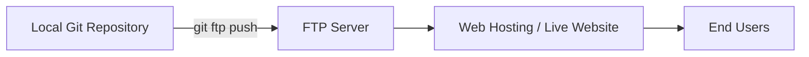

# 💙 Git-FTP Made Easy — Complete Beginner & Advanced Guide

**Prepared by:** Shaik Sameer Shubhan  
**Theme:** Professional Blue Edition  
**Version:** 2.0 (With Windows Installation + Automation)

---

## 🧭 Overview

**Git-FTP** is a Git extension that allows you to **deploy your website or code directly to an FTP server** using Git commands.  
Instead of uploading all files each time, Git-FTP uploads **only the changed files**, saving time and bandwidth.

---

## ⚙️ Installation on Windows

### 🪟 Method 1: Git Bash Installation (Recommended)

1. Open **Git Bash**.
2. Run the following command to download Git-FTP:

   ```bash
   curl -O https://raw.githubusercontent.com/git-ftp/git-ftp/master/git-ftp
   chmod +x git-ftp
   ```

3. Move it to a directory in your PATH (for example):

   ```bash
   sudo mv git-ftp /usr/local/bin/
   ```

4. Verify the installation:

   ```bash
   git ftp --version
   ```

✅ If you see the version number, Git-FTP is installed successfully.

---

### 🍫 Method 2: Install via Chocolatey (Simplest)

If you use **Chocolatey**, simply run:

```bash
choco install git-ftp
```

Once installed, verify with:

```bash
git ftp --version
```

---

## 🧩 Basic Git-FTP Commands

| Command | Description | Example |
|----------|--------------|----------|
| `git ftp init` | Initialize and upload all project files to FTP for the first time. | `git ftp init -u username -p password ftp://example.com/public_html/` |
| `git ftp push` | Upload only changed files since last upload. | `git ftp push -u username -p password ftp://example.com/public_html/` |
| `git ftp catchup` | Mark existing FTP files as up-to-date (use when syncing for the first time). | `git ftp catchup -u username -p password ftp://example.com/public_html/` |
| `git ftp show` | Display last deployed commit hash. | `git ftp show` |
| `git ftp log` | Show upload history. | `git ftp log` |
| `git ftp clean` | Remove deleted files from FTP. | `git ftp clean` |
| `git ftp download` | Download files from FTP to local machine. | `git ftp download ftp://example.com/public_html/` |

---

## 🧠 Configuration Commands

```bash
git config git-ftp.url "ftp://example.com/public_html/"
git config git-ftp.user "username"
git config git-ftp.password "password"
git config git-ftp.syncroot "dist/"
git config git-ftp.insecure 1
```

These settings are stored in your `.git/config` file and used automatically with every command.

---

## 🧱 Include & Ignore Files

Use `.git-ftp-include` and `.git-ftp-ignore` files to control uploads.

### Example: `.git-ftp-ignore`
```
node_modules/
README.md
.gitignore
```

### Example: `.git-ftp-include`
```
!dist/*
!index.html
```

---

## 🧭 Workflow Diagram (Mermaid)



### ASCII Diagram (Plain Text Alternative)
```
[Local Repo] --git ftp push--> [FTP Server] --> [Live Website] --> [Users]
```

---

## ⚙️ Advanced Commands & Flags

| Command | Description |
|----------|--------------|
| `git ftp push --auto-init` | Automatically initialize if FTP not yet set up. |
| `git ftp push --dry-run` | Show which files will be uploaded, without uploading. |
| `git ftp push --force` | Force push all changes even if hashes mismatch. |
| `git ftp push -v` | Verbose output (detailed upload logs). |
| `git ftp push --syncroot build/` | Upload only files from a specific folder. |

---

## 🤖 CI/CD Automation

### 🚀 GitHub Actions Example

```yaml
name: Deploy via Git-FTP
on:
  push:
    branches:
      - main

jobs:
  deploy:
    runs-on: ubuntu-latest
    steps:
      - name: Checkout Repository
        uses: actions/checkout@v3

      - name: Install Git-FTP
        run: sudo apt-get install git-ftp -y

      - name: Deploy via Git-FTP
        run: |
          git ftp push --auto-init             --user ${{ secrets.FTP_USERNAME }}             --passwd ${{ secrets.FTP_PASSWORD }}             ftp://ftp.example.com/public_html/
```

### 🧰 Jenkins Integration Example

```groovy
pipeline {
    agent any
    stages {
        stage('Deploy') {
            steps {
                sh 'git ftp push --user $FTP_USER --passwd $FTP_PASS ftp://ftp.example.com/public_html/'
            }
        }
    }
}
```

### ☁️ Render / AWS / DigitalOcean Notes

- For Render: Git-FTP is not needed — use `git push` since Render auto-builds.  
- For AWS EC2 or Lightsail: Use Git-FTP for **file-level syncs** via `ec2-user` credentials.  
- For DigitalOcean: Works directly via FTP or SFTP endpoints.

---

## 🩵 Tips & Best Practices

💡 **Use environment variables** for credentials:  
```bash
export GIT_FTP_USER="username"
export GIT_FTP_PASSWD="password"
```

💡 Always run `git ftp catchup` when connecting to a live FTP server for the first time.

⚠️ **Never store plain-text passwords** in config files. Use `.netrc` or environment secrets.

💡 Add `.git-ftp-ignore` early to avoid uploading sensitive files.

---

## 🧰 Troubleshooting

| Problem | Possible Cause | Fix |
|----------|----------------|-----|
| `Authentication failed` | Wrong credentials | Recheck username/password |
| `Permission denied` | FTP user lacks write access | Update permissions on server |
| `Unknown option` | Outdated Git-FTP version | Update Git-FTP |
| `Files not updating` | Missing catchup or hash mismatch | Run `git ftp catchup` then `git ftp push` |

---

## 🌐 Official References

- 🔗 [Git-FTP GitHub Repository](https://github.com/git-ftp/git-ftp)  
- 🔗 [Git-SCM Documentation](https://git-scm.com/docs/git-ftp)  
- 🔗 [DigitalOcean FTP Deployment Guide](https://www.digitalocean.com/community/tutorials/how-to-use-git-ftp-to-deploy-your-website)  

---

## 🏁 Summary

Git-FTP simplifies your deployment workflow by **automating FTP uploads directly from Git**.  
Once configured, a single command keeps your server perfectly in sync with your repository.  

💙 *Now you can deploy like a pro — safely, efficiently, and smartly!*

---
