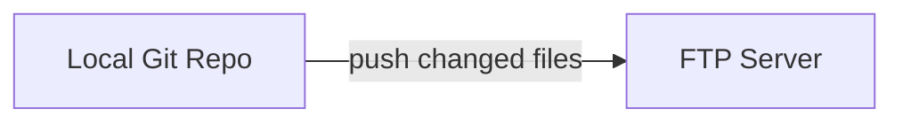
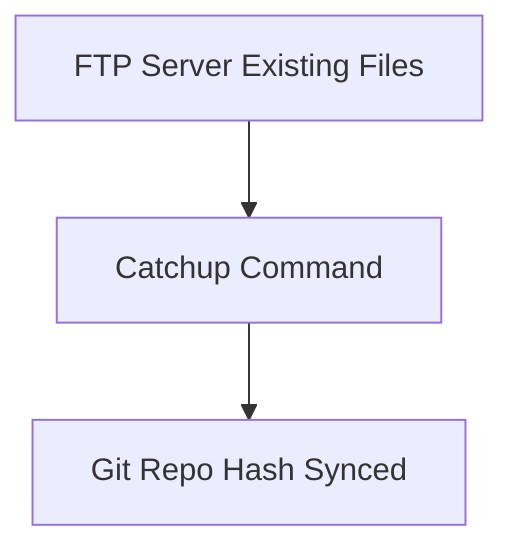
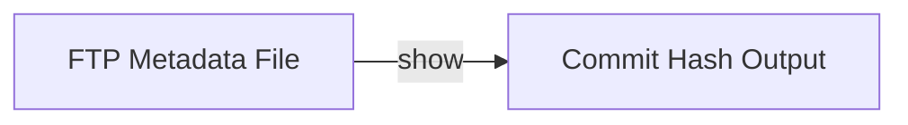
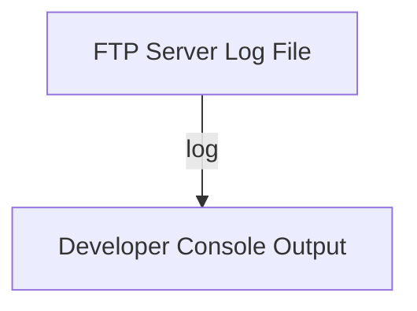
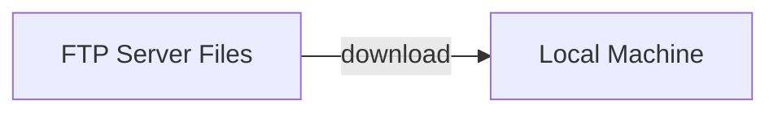
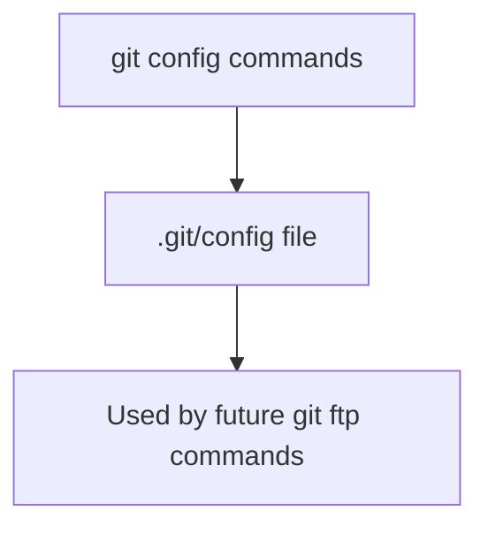
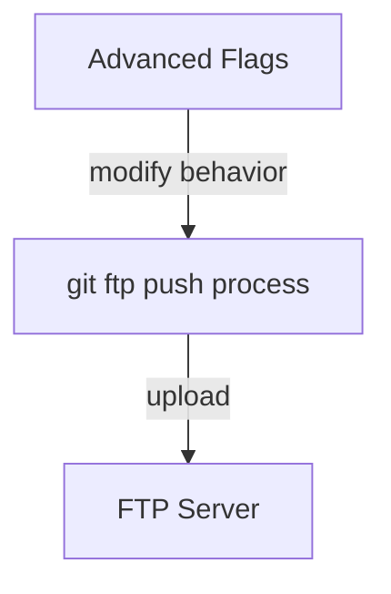
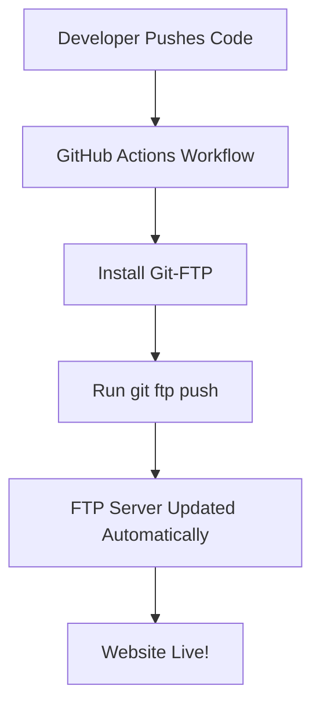

# 💙 Git-FTP Made Easy — Complete Beginner & Advanced Guide

**Prepared by:** Shaik Sameer Shubhan  
**Theme:** Professional Blue Edition  
**Version:** 3.0 (Includes Windows Installation + Automation + Examples)

---

## 🧭 Overview

**Git-FTP** is a Git extension that lets you **deploy your project directly to an FTP server** using Git commands.  
It uploads **only changed files** since the last commit — saving time, bandwidth, and effort.

---

## ⚙️ Installation on Windows

### 🐧 Method 1: Git Bash (Recommended)

1. Open **Git Bash**.  
2. Run:
   ```bash
   curl -O https://raw.githubusercontent.com/git-ftp/git-ftp/master/git-ftp
   chmod +x git-ftp
   sudo mv git-ftp /usr/local/bin/
   ```
3. Verify installation:
   ```bash
   git ftp --version
   ```

✅ *If version appears — installation succeeded.*

---

### 🍫 Method 2: Chocolatey (Simplest)
```bash
choco install git-ftp
```

Verify:
```bash
git ftp --version
```

---

## 🚀 Basic Git-FTP Commands (with Examples)

### 1️⃣ `git ftp init` — First-time upload
Uploads the entire project to FTP for the first time.

```bash
git ftp init -u username -p password ftp://example.com/public_html/
```
📘 *Use only once to initialize deployment.*


---

### 2️⃣ `git ftp push` — Upload only changes
Uploads only modified files since last deployment.

```bash
git ftp push -u username -p password ftp://example.com/public_html/
```
📘 *Fast sync of updated files only.*



---

### 3️⃣ `git ftp catchup` — Mark server as up to date
When you already have files on FTP but not deployed with Git-FTP.

```bash
git ftp catchup -u username -p password ftp://example.com/public_html/
```
📘 *Syncs commit hash to server without uploading anything.*



---

### 4️⃣ `git ftp show` — View last deployed commit
```bash
git ftp show
```
📘 *Displays last uploaded Git commit hash.*



---

### 5️⃣ `git ftp log` — View upload logs
```bash
git ftp log
```
📘 *Shows deployment history and timestamps.*



---

### 6️⃣ `git ftp clean` — Remove deleted files
```bash
git ftp clean
```
📘 *Deletes remote files removed locally.*


---

### 7️⃣ `git ftp download` — Download remote files
```bash
git ftp download ftp://example.com/public_html/
```
📘 *Pulls project files from FTP to local folder.*



---

## 🧩 Configuration Commands

Before using Git-FTP, configure once per project:

```bash
git config git-ftp.url "ftp://example.com/public_html/"
git config git-ftp.user "username"
git config git-ftp.password "password"
git config git-ftp.syncroot "dist/"
git config git-ftp.insecure 1
```

✅ *These are stored inside `.git/config` for auto-use.*



---

## 📁 Include & Ignore Files

Control what gets uploaded:

### `.git-ftp-ignore`
```
node_modules/
README.md
.gitignore
```

### `.git-ftp-include`
```
!dist/*
!index.html
```


---

## ⚙️ Advanced Commands & Flags

| Command | Description | Example |
|----------|--------------|----------|
| `git ftp push --auto-init` | Auto initializes if FTP not yet set up | `git ftp push --auto-init ftp://example.com/public_html/` |
| `git ftp push --dry-run` | Show which files would be uploaded | `git ftp push --dry-run` |
| `git ftp push --force` | Force upload even if hash mismatch | `git ftp push --force` |
| `git ftp push -v` | Verbose output for debugging | `git ftp push -v` |
| `git ftp push --syncroot build/` | Upload only a folder | `git ftp push --syncroot build/` |



---

## 🧠 Examples for Common Workflows

### 🔹 Full Deployment (First Time)
```bash
git ftp init -u user -p pass ftp://example.com/public_html/
```

### 🔹 Normal Update
```bash
git add .
git commit -m "Updated homepage"
git ftp push
```

### 🔹 After Manual FTP Upload
```bash
git ftp catchup
git ftp push
```

---

## ☁️ CI/CD Automation — GitHub Actions

Automate deployment when pushing to `main` branch.

```yaml
name: Deploy Website via Git-FTP
on:
  push:
    branches: [ main ]

jobs:
  deploy:
    runs-on: ubuntu-latest
    steps:
      - name: Checkout Code
        uses: actions/checkout@v3

      - name: Install Git-FTP
        run: sudo apt-get install git-ftp -y

      - name: Deploy via Git-FTP
        run: |
          git ftp push --auto-init             --user ${{ secrets.FTP_USER }}             --passwd ${{ secrets.FTP_PASS }}             ftp://ftp.example.com/public_html/
```



---

## 💡 Tips & Best Practices

- Use **environment variables** for credentials:
  ```bash
  export GIT_FTP_USER="username"
  export GIT_FTP_PASSWD="password"
  ```
- Always run `git ftp catchup` before first push to existing server.  
- Avoid saving plain passwords — use GitHub Secrets or `.netrc`.  
- Maintain `.git-ftp-ignore` to skip unnecessary files.

---

## 🧰 Troubleshooting

| Issue | Cause | Fix |
|-------|--------|-----|
| `Authentication failed` | Wrong credentials | Check username/password |
| `Permission denied` | FTP user lacks write access | Update FTP permissions |
| `Unknown option` | Outdated version | Update Git-FTP |
| `No files uploaded` | Hash mismatch | Run `git ftp catchup` then `git ftp push` |

---

## 🧾 Command Summary

| Command | Purpose | Example |
|----------|----------|----------|
| `git ftp init` | Upload everything (first time) | `git ftp init ftp://...` |
| `git ftp push` | Upload changed files | `git ftp push ftp://...` |
| `git ftp catchup` | Sync server with current commit | `git ftp catchup ftp://...` |
| `git ftp show` | Show deployed commit hash | `git ftp show` |
| `git ftp log` | Show deployment history | `git ftp log` |
| `git ftp clean` | Remove deleted files from FTP | `git ftp clean` |
| `git ftp download` | Download remote files | `git ftp download ftp://...` |
| `git ftp push --dry-run` | Preview uploads | `git ftp push --dry-run` |
| `git ftp push --force` | Force upload | `git ftp push --force` |
| `git ftp push --auto-init` | Initialize automatically | `git ftp push --auto-init ftp://...` |

---

## 🌍 References

- 🔗 [Git-FTP GitHub Repo](https://github.com/git-ftp/git-ftp)  
- 🔗 [Git-SCM Documentation](https://git-scm.com/docs/git-ftp)  
- 🔗 [DigitalOcean FTP Deployment Guide](https://www.digitalocean.com/community/tutorials/how-to-use-git-ftp-to-deploy-your-website)

---

## 🏁 Summary

**Git-FTP** streamlines your website deployment process — just push your Git commits, and your site stays perfectly synced with your repo.  
It’s lightweight, fast, and ideal for simple web hosting servers.

💙 *Now you can deploy smarter, not harder.*
